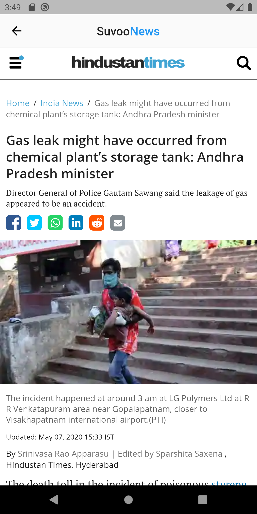
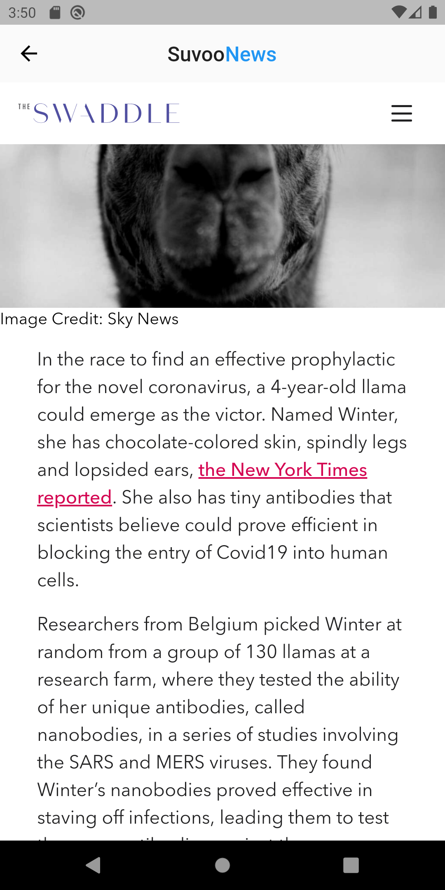

# News App for India
***App to fetch the headlines of today's news and display the articles natively in a web view.There are different categories of news to choose from : Business,General,Entertainment and much more***

**App made in Flutter entirely : **

# 📱 APK file Link ► https://bit.ly/newsIndia

Preview of the app :

 &nbsp;&nbsp;&nbsp;  &nbsp;&nbsp;&nbsp;    &nbsp;&nbsp;&nbsp;

The API used for the news and headlines is updated at regularl intervals  and keeps it updated.
# https://newsapi.org/

